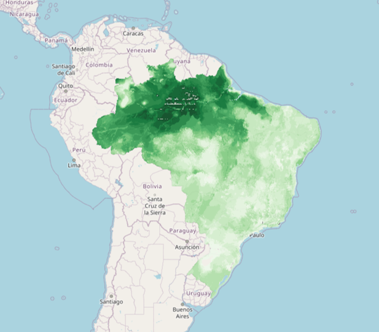
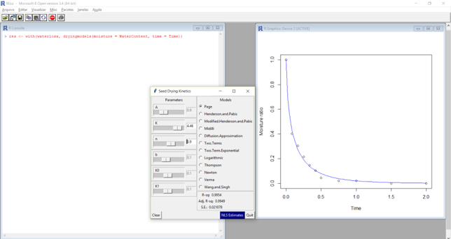
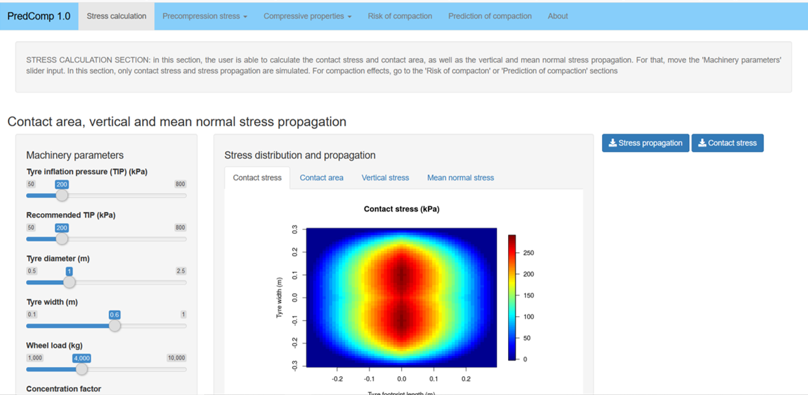
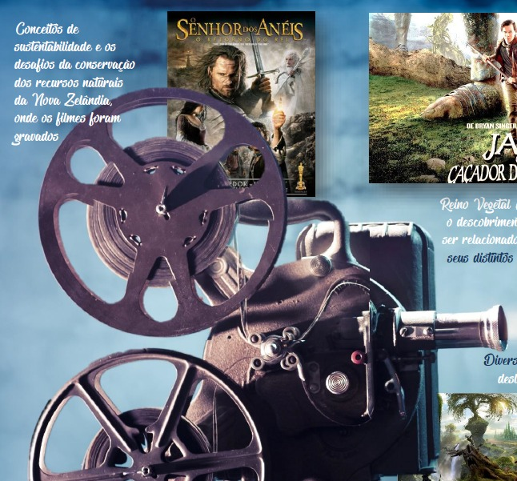

## Conteúdo

   * [&#x1f5fa; Mapas](#mapas)
   * [&#x1f4bb; Software](#software)
   * [&#x1f393; Cursos e treinamentos](#cursos-e-treinamentos)
   * [&#x1f4dd; Protocolos e processos](#protocolos-e-processos)
   * [&#128240; Produtos bibliográficos](#produtos-bibliográficos)
   * [&#x2709; Contato](#contato)

----

## Mapas

Preview | Produto | Ano
-----------|:------------------------------------------------------|:----- 
 | MAPAS DE USO E COBERTURA DO SOLO DO MATOPIBA, EM 2008 E 2018. Produção técnica resultado da dissertação do discente Temístocles Pacheco Lima, defendida em 2020 no PPG-CRENAC/IFGoiano. | 2020
 | MAPA INTERATIVO DA CAPACIDADE DE SUPORTE DE CARGA DE SOLOS DA BACIA HIDROGRÁFICA DO RIO PRETO - BA. Prod. técnica resultado da dissertação do discente Ítalo Rômulo Mendes de Souza, defendida em 2020 no PPG-CRENAC do IF Goiano, campus Urutaí. [Descrição completa](produtos/2020/mapa_bhrp.md). [DOI:10.33837/cr.map.0120](https://doi.org/10.33837/cr.map.0120) | 2020
 | MAPAS DE RIQUEZA DE ESPÉCIES DE PLANTAS INVASORAS NO BRASIL NOS CENÁRIOS ATUAL E FUTURO (2080). Prod. técnica da dissertação de Luiza Gabriela Fulgêncio Lima, defendida em 2018 no PPG-CRENAC/IFGoiano. | 2020
 | MAPA DE RIQUEZA DE ESPÉCIES DE TARTARUAS TERRESTRES NO BRASIL. Prod. técnica da dissertação de Luiza Gabriela Fulgêncio Lima, defendida em 2018 no PPG-CRENAC/IFGoiano. | 2020

----

## Software

Preview | Produto | Ano
-----------|:------------------------------------------------------|:----- 
 | _seedwater_: models for drying and soaking kinetics of seeds (version 1.0). [Descrição completa](produtos/2020/software_seedwater.md). Registro INPI: BR512019000731-0 | 2019
 | _PredComp_: Predition of Soil Compaction Induced by Agricultural Field Traffic. [Descrição completa](produtos/2020/software_predcomp.md). Registro INPI: BR512020001301-5 | 2020

----

## Cursos e treinamentos

em breve...

----

## Protocolos e processos

em breve...

----

## Produtos bibliográficos

Preview | Produto | Ano
-----------|:------------------------------------------------------|:----- 
 | Cartilha de filmes para sere utilizados em aulas de Educação Ambiental. [Descrição completa]() | 2020

----

## Contato
E-mail: ppgcrenac.urt@ifgoiano.edu.br

Coordenação: daniel.paivasilva@ifgoiano.edu.br
