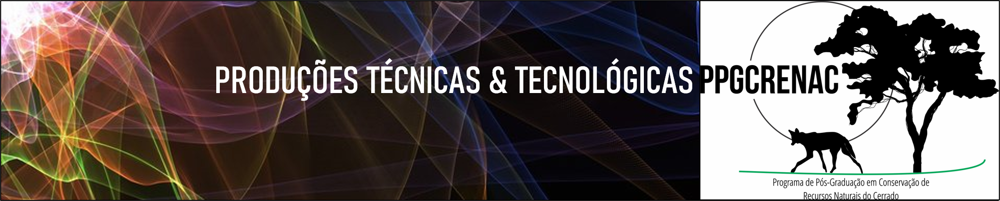
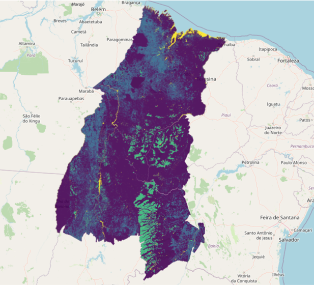
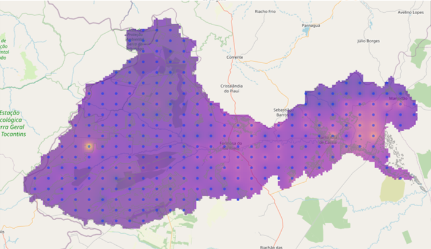
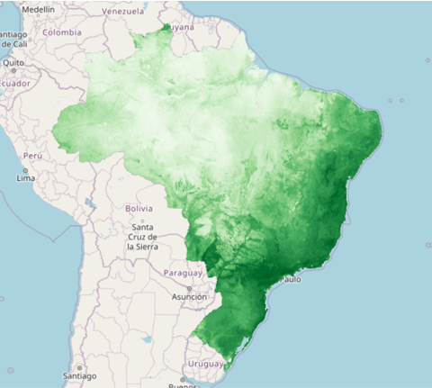

## Conteúdo

   * [&#x1f5fa; Mapas](#mapas)
   * [&#x1f4bb; Software](#software)
   * [&#x1f393; Cursos e treinamentos](#cursos-e-treinamentos)
   * [&#x1f4dd; Protocolos e processos](#protocolos-e-processos)
   * [&#x2709; Contato](#contato)

----

## Mapas

Preview | Produto | Ano
-----------|:------------------------------------------------------|:----- 
 | MAPAS DE USO E COBERTURA DO SOLO DO MATOPIBA, EM 2008 E 2018. Produção técnica resultado da dissertação do discente Temístocles Pacheco Lima, defendida em 2020 no PPG-CRENAC/IFGoiano. | 2020
 | MAPA INTERATIVO DA CAPACIDADE DE SUPORTE DE CARGA DE SOLOS DA BACIA HIDROGRÁFICA DO RIO PRETO - BA. Prod. técnica resultado da dissertação do discente Ítalo Rômulo Mendes de Souza, defendida em 2020 no PPG-CRENAC do IF Goiano, campus Urutaí. [Descrição completa](produtos/2020/mapa_bhrp.md) | 2020
 | MAPAS DE RIQUEZA DE ESPÉCIES DE PLANTAS INVASORAS NO BRASIL NOS CENÁRIOS ATUAL E FUTURO (2080). Prod. técnica da dissertação de Luiza Gabriela Fulgêncio Lima, defendida em 2018 no PPG-CRENAC/IFGoiano. | 2020

----

## Software

em breve...

----

## Cursos e treinamentos

em breve...

----

## Protocolos e processos

em breve...

----

## Contato
E-mail: ppgcrenac.urt@ifgoiano.edu.br
